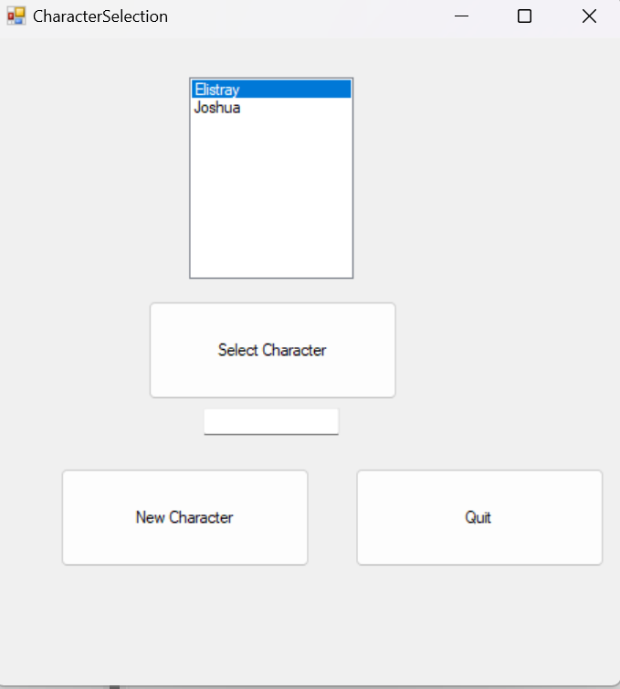
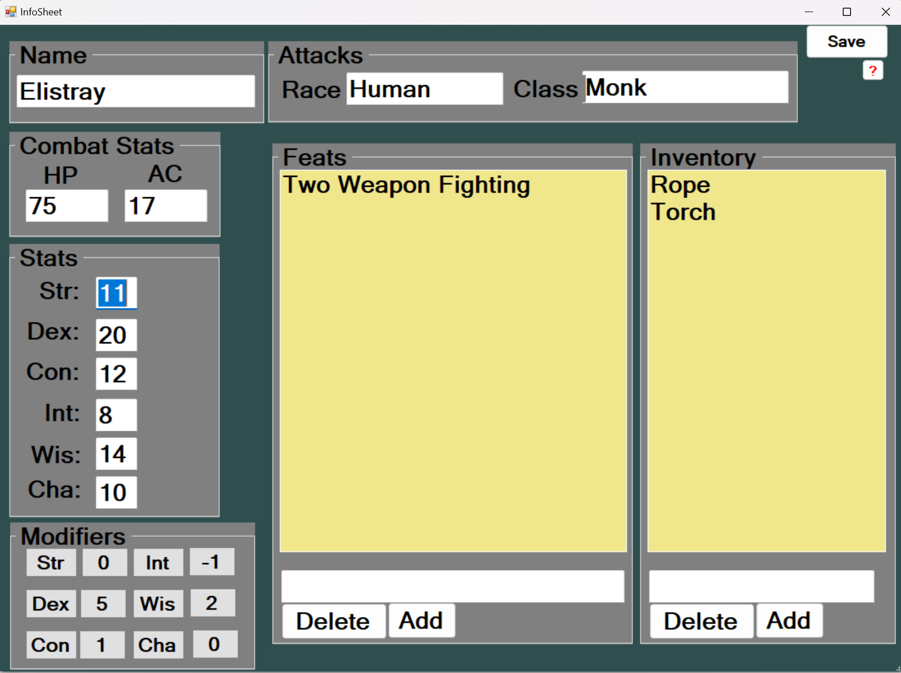

# This site is here to provide a look into my process of redesigning an old project I had programmed. 

## The Character Selection Screen Before
Seen below is the character selection screen where users are able to load or create new characters.
<!--  -->

## The Character Selection Screen After
## The Character Information Screen
This is the bulk of the program, where users are able to input and change the information related to a DND character. The sheet also includes the standard stat modifiers calaculated.  

